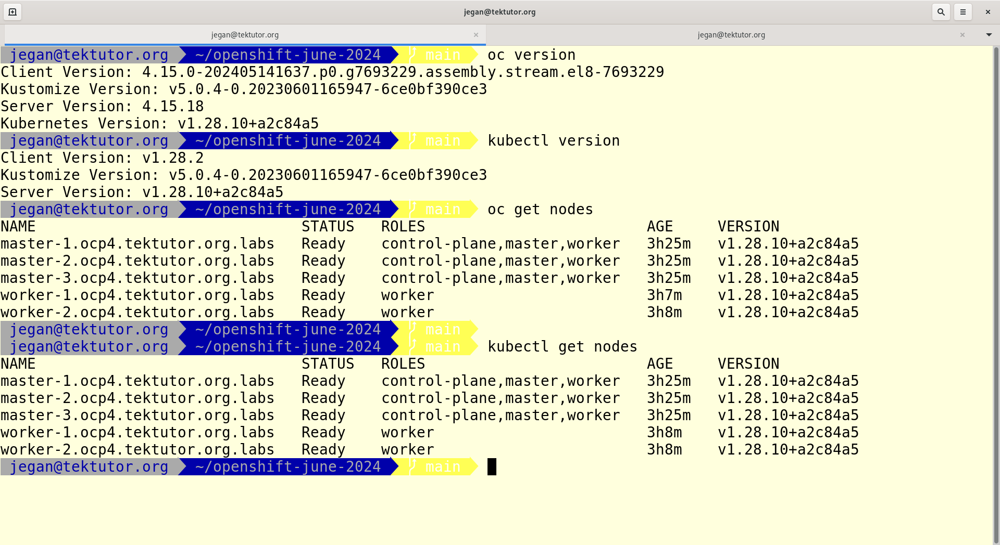

# Day 1

## Cloning this repository on the RPS Linux machine
```
cd ~
git clone https://github.com/tektutor/openshift-june-2024.git
cd openshift-june-2024
ls
```

## Testing lab environment
```
oc version
kubectl version

oc get nodes
kubectl get nodes

cat ~/openshift.txt
```

Expected output


## What is Hypervisor ?

<pre>
- virtualization technology
- it allows us running multiple os on the same machine
- many OS can be actively running side by side on the same machine
- each Virtual Machine represents one fully function operating system
- we can install windows/linux/mac in the virtual machine
- the Operating System installed inside the Virtual machine is called Guest OS
- the virtualization software is of two types
  1. Type 1 - Bare Metal Hypervisor ( Installed in Servers/Workstations )
  2. Type 2 - Installed in Laptops/Desktops/Workstations
- this is considered heavy-weight virtualization as each Virtual Machine has to allocated with dedicated hardware resources
  - CPU Cores
  - RAM
  - Disk Storage
  - Grapics Card ( Virtual )
  - Network Card ( virtual )
- Examples
  - VMWare vSphere/vCenter - Type 1 Hypervisor ( Bare Metal ) - Commercial Product
  - VMWare Workstation - Type 2 - Linux/Windows - commercial product
  - VMWare Fusion - Type 2 - Mac - commerical product
  - Oracle Virtual Box - Type 2- works in Linux/Windows/Mac and it is Free
  - KVM - Type 2 - works in all Linux Distributions
  - Parallels - Type 2 - works in Mac
  - Hyper-V - Type 2 - works in Windows Server grade OS
</pre>

## Info - Containerization
<pre>
- is an application virtualization technology
- each container represents one application process
- container are not operating sysytem, they don't their own OS Kernel
- each container either represents one fully function application or a application component
  - application component ( database server, web server, application server, etc., )
  - application - CRM, etc.,
    - an application might requires more than one container in some cases
- light-weight virtualization technology
  - containers doesn't require dedicated hardwares as they use the hardware resources available on the host operating system
- there are some similaries between containers and virtual machines
  - just like Virtual machines acquire their own IP, containers also get their own IP usually (Private IPs)
  - just like Virtual machines has a Network Card, containers also has a network card
  - just like Virtual machines has their own Network stack, containers also has their own network stack
  - containers has a file system just like virtual machine
  - containers has own port range ( 0 - 65535 ) just like virtual machines
- containers will never be able to replace virtual machine as virtual machine runs an Operating System, while container runs a single application
</pre>
