# Day 1

## Cloning this repository on the RPS Linux machine
```
cd ~
git clone https://github.com/tektutor/openshift-june-2024.git
cd openshift-june-2024
ls
```

## Testing lab environment
```
oc version
kubectl version

oc get nodes
kubectl get nodes

cat ~/openshift.txt
```

Expected output


## What is Hypervisor ?

<pre>
- virtualization technology
- it allows us running multiple os on the same machine
- many OS can be actively running side by side on the same machine
- each Virtual Machine represents one fully function operating system
- we can install windows/linux/mac in the virtual machine
- the Operating System installed inside the Virtual machine is called Guest OS
- the virtualization software is of two types
  1. Type 1 - Bare Metal Hypervisor ( Installed in Servers/Workstations )
  2. Type 2 - Installed in Laptops/Desktops/Workstations
- this is considered heavy-weight virtualization as each Virtual Machine has to allocated with dedicated hardware resources
  - CPU Cores
  - RAM
  - Disk Storage
  - Grapics Card ( Virtual )
  - Network Card ( virtual )
- Examples
  - VMWare vSphere/vCenter - Type 1 Hypervisor ( Bare Metal ) - Commercial Product
  - VMWare Workstation - Type 2 - Linux/Windows - commercial product
  - VMWare Fusion - Type 2 - Mac - commerical product
  - Oracle Virtual Box - Type 2- works in Linux/Windows/Mac and it is Free
  - KVM - Type 2 - works in all Linux Distributions
  - Parallels - Type 2 - works in Mac
  - Hyper-V - Type 2 - works in Windows Server grade OS
</pre>

## Info - Containerization
<pre>
- is an application virtualization technology
- each container represents one application process
- container are not operating sysytem, they don't their own OS Kernel
- each container either represents one fully function application or a application component
  - application component ( database server, web server, application server, etc., )
  - application - CRM, etc.,
    - an application might requires more than one container in some cases
- light-weight virtualization technology
  - containers doesn't require dedicated hardwares as they use the hardware resources available on the host operating system
- there are some similaries between containers and virtual machines
  - just like Virtual machines acquire their own IP, containers also get their own IP usually (Private IPs)
  - just like Virtual machines has a Network Card, containers also has a network card
  - just like Virtual machines has their own Network stack, containers also has their own network stack
  - containers has a file system just like virtual machine
  - containers has own port range ( 0 - 65535 ) just like virtual machines
- containers will never be able to replace virtual machine as virtual machine runs an Operating System, while container runs a single application
</pre>

## Info - Is it possible to run multiple application within a container?
<pre>
- Yes, it is possible to run multiple applications in a container
- How docker or podman let's you run multiple applications inside a container is, the main container will run a utility called supervisord which will spin separate process to run the applications and the supervisord monitors the health and status of the child processes, which is a overhead, hence though it works it is not a recommnended best practice
- recommendation is, one application per container
</pre>  

## Info - Container Runtime Overview
<pre>
- low-level software to manage container images and containers
- not user-friendly
- generally not used by end-users
- examples
  - CRI-O Container Runtime
  - runC container runtime
</pre>

## Info - Container Engine Overview
<pre>
- high-level software used to manage containers and images
- very user-friendly
- without knowing low-level container related kernel knowledge we can easily manage containers
- internally container engines depend on Container Runtime to manage containers and images
- Examples
  - Docker is a Container Engine which depends on containerd which in turn depends on runC container runtime
  - Podman is a Container Engine which depends on CRI-O Container runtime
</pre>

## Info - Docker Overview
<pre>
- is developed in Golang by Docker Inc organzation
- comes in 2 flavours
  1. Community Edition - Docker CE ( Free )
  2. Enterprise Edition - Docker EE ( Paid )
- follow Client/Server Architecture
- in most cases, when we create containers they provide us root access irrespective of whether you are administrator or not
- Docker supports rootless containers
</pre>

## Info - Podman Overview
<pre>
- is a container engine which internally depends on CRI-O Container Runtime
- Red Hat Openshift supported Docker(run-C) until v3.11
- Red Hat Openshift supports only CRI-O container runtime and Podman within Red Hat Openshift
- Red Hat Openshift v4.x onwards Docker and other container runtime support is removed
</pre>

## Info - Container Orchestration Platforms Overview
<pre>
- though containerized application workloads can be managed manually, in real-world application companies don't manage containers directly/manually
- generally every organization uses Container Orchestration Platforms to manage their containerized application workloads
- Examples
  - Docker SWARM
  - Google Kubernetes
  - Red Hat Openshift
  - AWS - Kubernetes Managed Service called EKS (Elastic Kubernetes Service)
  - Azure - Kubernetes Managed Service called AKS (Azure Kuberentes Service )
  - AWS - Red Hat Managed Openshift service called ROSA
  - Azure - Red Hat Managed Openshift service called ARO
</pre>

#### Docker SwARM
<pre>
- Docker SWARM is Docker Inc native Container Orchestration Platform
- it supports managing only Docker containerized application workloads
- it is light weight setup, hence we can install this in a laptop with even a basic configuration
- it is easy to install, learn
- it is not production-grade, generally used for learning purpose, can be used in dev/qa environment
</pre>


#### Google Kubernetes
<pre>
- developed by Google in Golang
- robust container orchestration platform
- supports many different types of container runtimes including runc, containerd, CRI-O, etc.,
- it also supports adding additional functionality by adding your own Custom Resource and custom controllers
- to extend Kubernetes, we can develop an Kubernetes Operator and add new functionalities
- Operators => is a combination of many Custom Resource + Custom Controllers
- is opensource
- supports command-line interface only
- time tested and robust can be used in Production
- Kubernetes Dashboard ( webconsole - it is basic - it poses some security issues, so the first thing administrators does is to disable this )
</pre>

#### Red Hat Openshift
<pre>
- is developed on top of Google Kubernetes
- Red Hat developed many operators and extended Kubernetes to support many practical features required by IT industry
- Red Hat supports 
  - User Management ( Role Based Access Control - RBAC )
  - Comes with Internal Container Registry
  - Comes with S2I
    - We can deploy application from source code grabbed from Version control softwares ( Not supported in K8s )
    - We build and deploy application from within Openshift
  - CI/CD Platform
  - Supports Virtualization
  - Routes - allows us expose our application with a friendly public url
</pre>

## Red Hat Openshift - Control Plane Components
<pre>
- API Server (Pod)
- etcd key-value data-store (Pod)
- controller managers (Pod)
- scheduler (Pod)
</pre>

#### API Server
<pre>
- support REST APIs for every feature supported in Kubernetes/Openshift
- the entire status and application status is stored in the etcd database by the API Server
- no components in Openshift talk to each other directly
- API Server is the only componenent which can udpate the etcd database
- all openshift components they only communicate with API Server via REST calls
- any time the API Server updates the etcd database it will send a broadcasting event
  - Examples
    - new deployment created
    - new replicaset created
    - new pod created
    - scaled up
    - scaled down
    - deployment updated
    - deployment delete
</pre>

#### etcd
<pre>
- key-value database
- this stores the application and cluster status
- if we backup the etcd, it is very easy to restore the same cluster else where
- opensource, independent project which can be used outside the scope of kubernetes/openshift
</pre>

#### controller managers
<pre>
- a group of many controller which provides monitoring
- each controller manages one type of resource in Kubernetes/Openshift
- Deployment Controller manages Deployment resource
- ReplicaSet Controller manages ReplicaSet resource
- Examples
  - Deployment Controller
  - ReplicaSet controller
  - StatefulSet controller
  - Job Controller
  - CronJob Controller
  - Endpoint Controller
  - DaemonSet Controller
</pre>

#### scheduler
<pre>
- this components recommends on which node a newly created Pod can be deployed  
- scheduler can't deploy a pod directly, hence it sends its scheduling recommendations to API Server via REST calls
</pre>


## Info - Pod Overview
<pre>
- Pod is a group of related containers 
- Pod is the smallest unit that can be deployed within Kubernetes/Openshift
- Pod is a resource stored and managed within etcd database by API Server
- Pod never runs anywhere,only  the container within them runs in worker or master nodes
- One Pod can container any number of containers
- Best practice is, 
  - only one main application should run per Pod
  - one Pod must represent a single application or a single application component ( microservice, webserver, app server, db server, etc.,)
- when we deploy our applications into Kubernetes/Openshift, they run inside a container which is part of a Pod
- In case of docker, every running container gets an IP address, but in Kubernetes/Openshift IP address is assigned only on the Pod level not on the container level
</pre>

Creating a pod with plain docker
```
docker run -d --name nginx_pause --hostname nginx gcr.io/google_containers/pause:latest
docker run -d --name nginx --network=container:nginx_pause nginx:latest
docker ps
docker inspect -f {{.NetworkSettings.IPAddress}} nginx_pause
docker exec -it nginx sh
hostname -i
exit
```
In the above, both the nginx_pause container and the nginx containers share the IP address.

Expected output


## Info - What is ReplicaSet ?
<pre>
- Let's say 1000s of users are trying a access a web hosted in a single Pod
- a single Pod instance won't be able to server 1000s of users, hence we may need to add more instances of the Pod
- to create and manage multiple Pod instances of a single application, Kubernetes/Openshift supports something called ReplicaSet
- ReplicaSet is a resource which is stored in etcd database
  - the container image that must be used to create containers under the Pod
  - it has desiredCount - tells how many Pod instances the user expects to run in Openshift
  - it has currentPod - tells how many Pod instances are actually running in the openshift 
  - it has availabe/ready Pod - tells how many Pod are in ready state to server end-users
- ReplicaSet is created by Deployment Controller
- ReplicaSet is accepted as an input by the ReplicaSet Controller
- ReplicaSet Controller creates so many Pods as mentioned in the desiredCount of the ReplicaSet
- ReplicaSet Controller is also reponsible for scale up/down
</pre>

## Info - What is Deployment?
<pre>
- stateless application are deployed as Deployment into Kubernetes/Openshift
- When we run the command 'oc create deployment nginx --image=bitnami/nginx --replicas=3' it creates the following in the openshift cluster
  - a Deployment resource
    - a replicaset resource
      - Pod 1
        - pause container ( running in worker-1 node )
        - nginx container ( running in worker-1 node )
      - Pod 2
        - pause container ( running in worker-2 node )
        - nginx container ( running in worker-2 node )
      - Pod 3
        - pause container ( running in master-2 node )
        - nginx container ( running in master-2 node )
</pre>

## Info - openshift project
<pre>
- Kubernetes supports something called namespace
- Kubernetes/openshift are generally shared by many teams within the organization
- Using namespace we can segregate the applications deployment by one team from the other teams
- Openshift has introduced a new feature called projects, which is based on namespace
- Using Openshifit projects we can give access only the team members while denying access to other users
</pre>

## Lab - Listing the Openshift 
```
oc get nodes
kubectl get nodes

kubectl get nodes -o wide
oc get nodes -o wide
```

Expected output
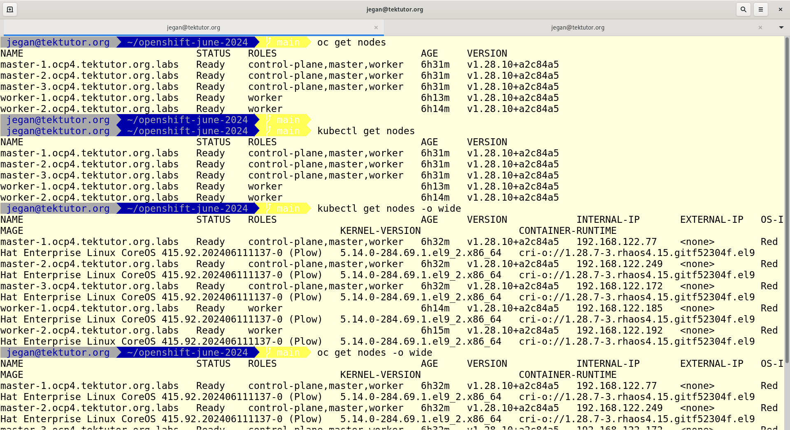
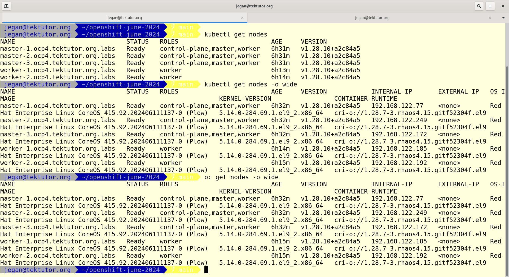

## Lab - Describe node to find more details about node
```
oc get nodes
oc describe node//master-1.ocp4.tektutor.org.labs
```

Expected output
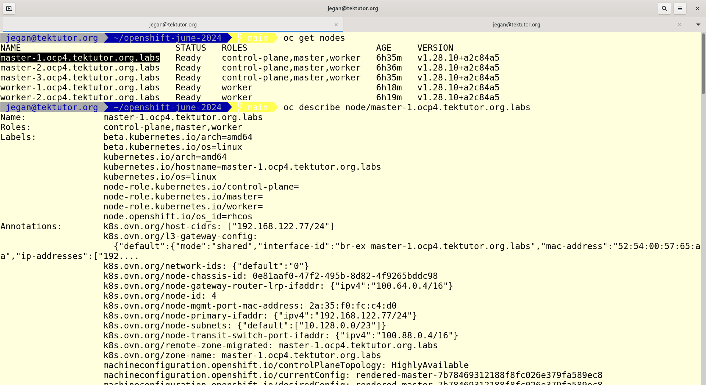
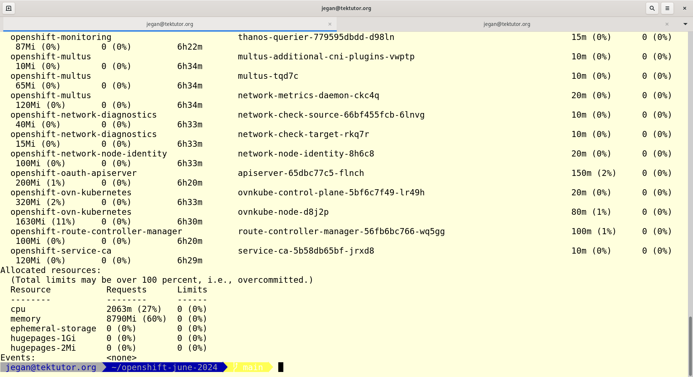

## Lab - Using explain command to know api details and definition of any resource in Openshift/Kubernetes
```
oc explain node
oc explain deployment
oc explain replicaset
oc explain pod
```

Expected output
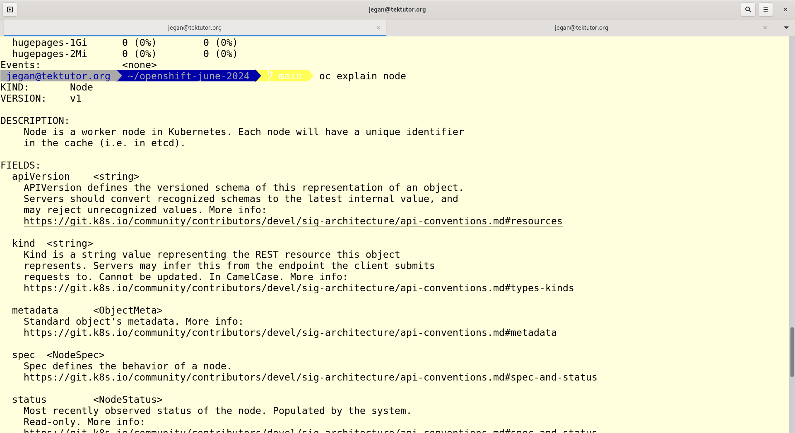
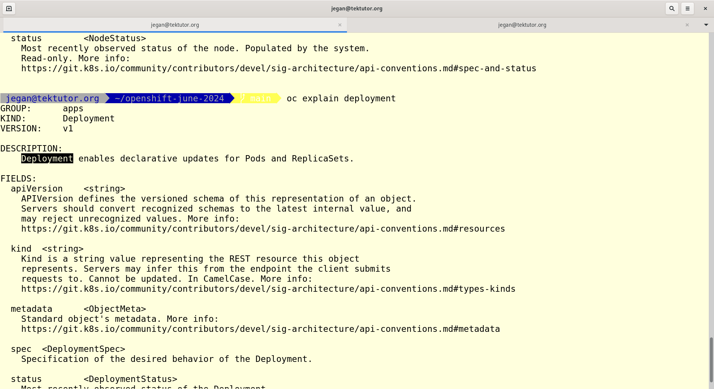


## Lab - Listing yaml definition of a specific node
```
oc get node/master-1.ocp4.tektutor.org.labs -o yaml
```

Expected output
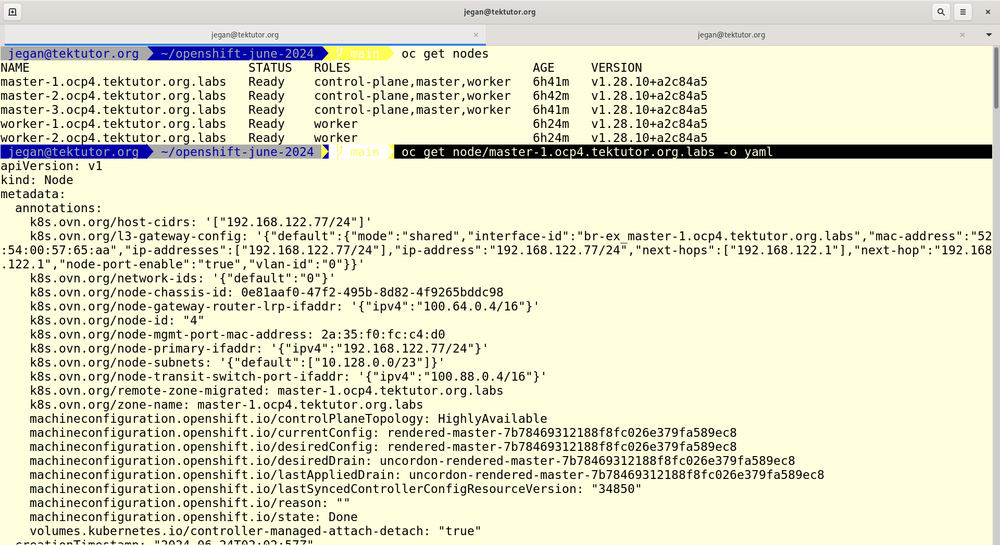
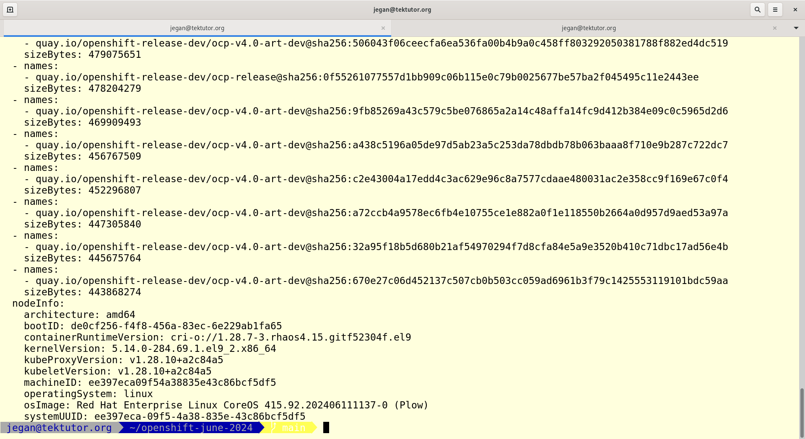

## Lab - Listing all project namespaces in openshift
```
oc get projects
oc get namespaces

oc get project
oc get namespace
```

Expected output


## Lab - Create a new project in your name
```
oc new-project jegan
```

Expected output
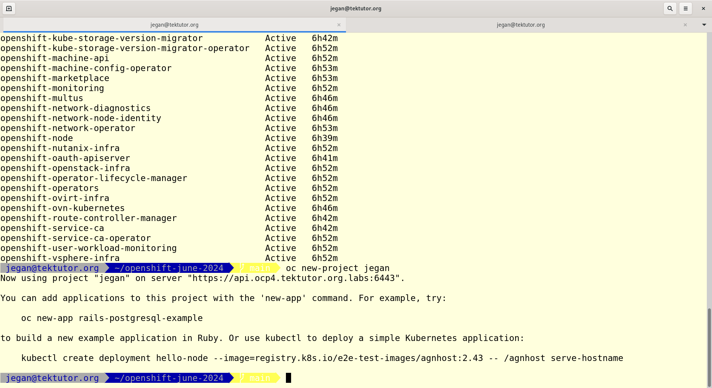

## Lab - Finding the currently active project
```
oc project
```

Expected output


## Lab - Switching between projects
```
oc project default
oc project jegan
```

Expected output


## Lab - Create your first deployment in imperative style
```
oc project jegan
oc project
oc create deployment nginx --image=nginx:latest --replicas=3
```

Listing the deployments in the active project
```
oc get deployments
oc get deployment
oc get deploy
```

Listing the replicasets in the active project
```
oc get replicasets
oc get replicaset
oc get rs
```

Listing the pods in the active project
```
oc get pods
oc get pod
oc get po
```

Expected output
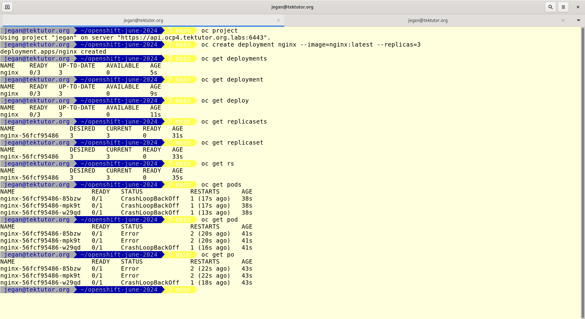


## Lab - Troubleshooting the Pod CrashLoopBackoff issue
Let's try to understand why the Pod is crashing
```
oc logs nginx-56fcf95486-85bzw
```

Expected output
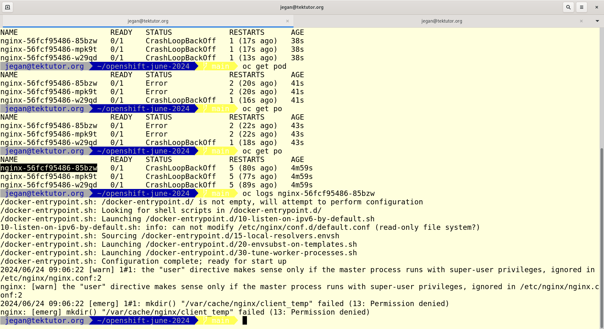

In Kubernetes, the Pod containers can run with/without admin privileges.  Hence, the Kubernetes cluster will not enforce best practices.

In Openshift, the openshift nodes are installed with Red Hat Enterprise Core OS (RHCOS). The RHCOS operating system enforces the best practices are always followed, when the container images doesn't the best practices it won't let the Pod run due to the violations.

In Openshift regular application is supposed to run with non-adminstrator privileges. Hence, not all folders are writable.  In this the docker image that we used is not prepared keep openshift guidelines in mind.  Hence, not all docker images will work in openshift, but the same docker image will work perfectly fine in Kubernetes.


## Lab - Deleting a deployment from your project
```
oc delete deploy/nginx
oc get deploy,rs,po
```

Expected output
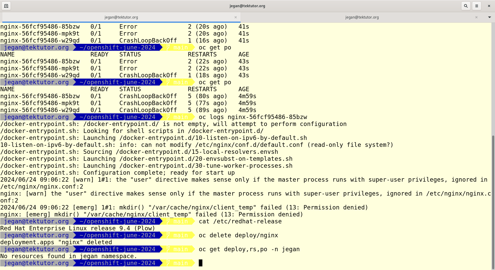

## Lab - Creating a nginx deployment using bitnami/nginx container image from Docker Hub Remote Registry
```
oc project jegan
oc create deployment nginx --image=bitnami/nginx:1.18 --replicas=3
oc get deploy,rs,po
oc get po -w
```

Listing the pod with their IP and node where they are deployed
```
oc get po -o wide
```

Expected output


## Lab - Getting inside the nodes where your application pod is running to understand some internal stuffs
```
oc get nodes
oc get po -o wide
oc debug node/master-3.ocp4.tektutor.org.labs

chroot /host

podman version
crictl version
```

List all container images present in the master 3 node
```
crictl images
```

List all containers running in the master node
```
crictl ps
```

List all containers that belong to a specific pod
```
crictl ps | grep nginx-566b5879cb-cqcsz
```

Expected output

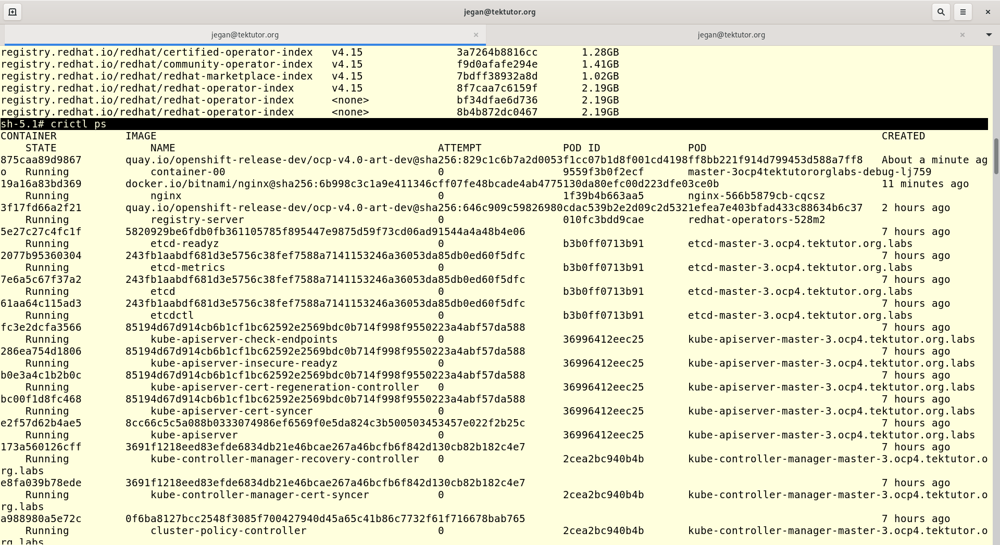

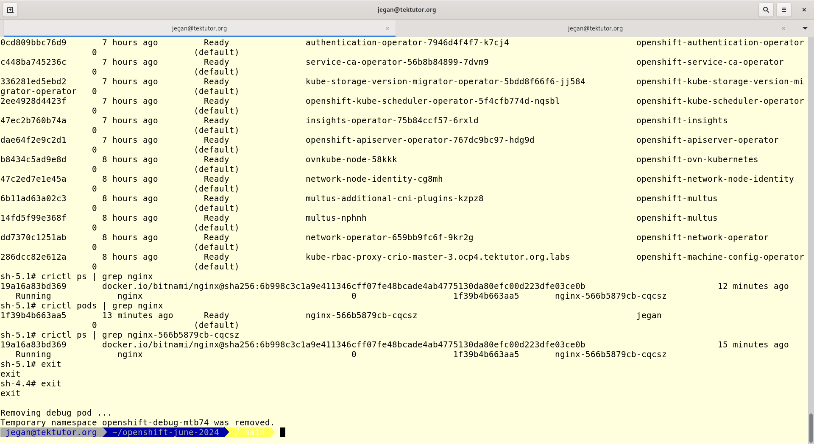
